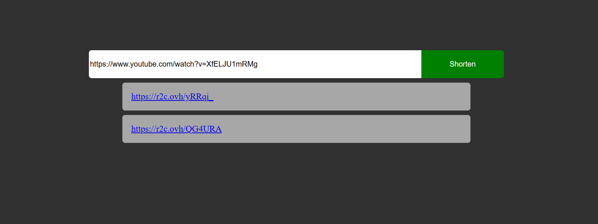

# url-shortening-srv

A URL shortening service.

## Requirements

Simple RESTful API that allows users to shorten long URLs. The API provide endpoints to create, retrieve, update, and delete short URLs. It also provides statistics on the number of times a short URL has been accessed.

## Preview



## Endpoints

- POST /shorten body: { url: string }
- GET / (index)
- GET /:shortUrl
- GET /:shortUrl/stats
- PUT /:shortUrl
- DELETE /:shortUrl

## Usage

To install dependencies:

```bash
bun install
```

To run:

```bash
bun run index.ts
```

## ShortCode Generation

The `generateShortCode` method in the `UrlModel` class is responsible for generating unique short codes for URLs. It works as follows:

1. It retrieves all existing short codes from the database and stores them in a `Set` to ensure uniqueness.
2. It generates a new short code using `randomBytes` to create a random string, which is then encoded in `base64url` format and truncated to 6 characters.
3. It checks if the generated short code already exists in the `Set` of existing short codes. If it does, it generates a new one until a unique short code is found.
4. The unique short code is then returned.

This ensures that each short code is unique and avoids collisions with existing short codes.

This method give us a total of 64^6 = 68,719,476,736 possible short codes, which should be sufficient for most use cases.

[A roadmap.sh project](https://roadmap.sh/projects/url-shortening-service)